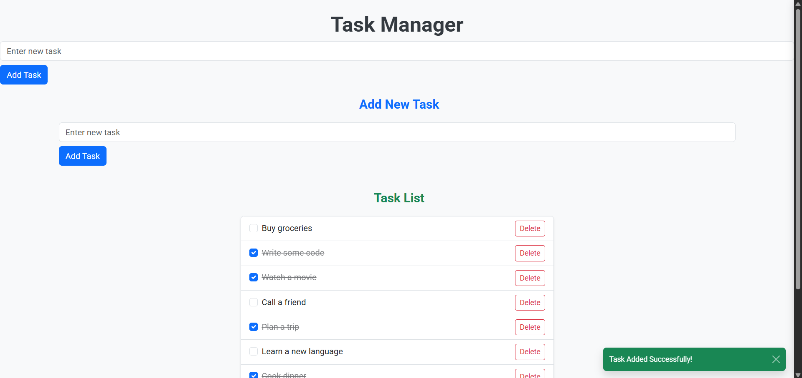

# Task Manager App

A simple Angular-based Task Manager application to help users add, delete, and manage tasks with a clean UI and Bootstrap styling.

---

## Features

* Add new tasks with a title.
* View a list of tasks.
* Mark tasks as complete or incomplete.
* Delete tasks.
* Toast notifications for task addition and deletion.
* Responsive UI using Bootstrap.
* Uses Bootstrap Icons for buttons and status.

---

## Technologies Used

* Angular (Standalone Components)
* TypeScript
* Bootstrap 5 (CSS and Icons)
* RxJS (Observables)
* REST API for backend (mock or real)
* Bootstrap Toast for notifications

---

## Screenshots

### Current UI




---

## Installation & Setup

1. **Clone the repository**

   ```bash
   git clone https://github.com/yourusername/task-manager.git
   cd task-manager
   ```

2. **Install dependencies**

   ```bash
   npm install
   ```

3. **Run the app**

   ```bash
   ng serve
   ```

4. Open your browser at `http://localhost:4200` to see the app running.

---

## Usage

* Use the input field and button at the top to add new tasks.
* Click the checkbox next to each task to mark it complete or incomplete.
* Use the trash icon button to delete tasks.
* Toast messages will appear confirming your actions.

---

## Project Structure

* `task-list.component.ts` — Displays the list of tasks and manages task operations.
* `add-task.component.ts` — Form component to add new tasks.
* `task.service.ts` — Handles API calls to fetch, add, update, and delete tasks.
* `task.ts` — Task data model interface.
* `screenshots/` — Folder to store UI screenshots for documentation.

---

## Future Improvements

* Add user authentication.
* Support task editing.
* Add due dates and priority levels.
* Add filtering and sorting options.
* Integrate with real backend APIs.

---

## License

This project is licensed under the MIT License.

---

If you want, I can help you generate screenshots or image placeholders based on your UI code. Just let me know!
